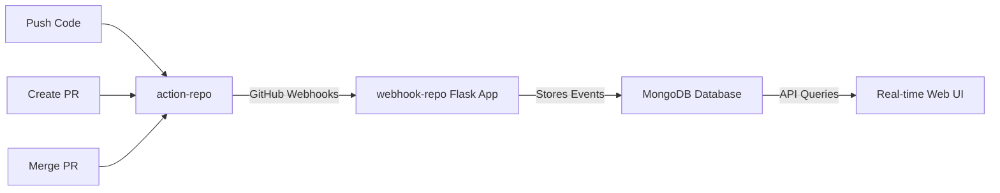

# 🚀 Action Repository - GitHub Webhook Assingment

**Part of the TechStax GitHub Webhook Monitoring System**

This repository serves as the **source repository** that generates GitHub events (pushes, pull requests, merges) which are captured by our [webhook-repo](../webhook-repo) monitoring system.

## 🎯 Project Overview

This is one of two repositories in the complete GitHub webhook monitoring solution:

- **action-repo** (this repo) → Generates GitHub events
- **[webhook-repo](../webhook-repo)** → Receives and displays webhook events

## 🏗️ System Architecture



## 📋 Monitored Events

Our webhook system captures and displays the following events from this repository:

| Event Type             | Trigger                   | Example Display                                                                              |
| ---------------------- | ------------------------- | -------------------------------------------------------------------------------------------- |
| **PUSH**         | Code pushed to any branch | `"john" pushed to "main" on 5th July 2025 - 10:30 PM UTC`                                  |
| **PULL_REQUEST** | New pull request opened   | `"sarah" submitted a pull request from "feature" to "main" on 5th July 2025 - 9:00 AM UTC` |
| **MERGE**        | Pull request merged       | `"mike" merged branch "hotfix" to "main" on 5th July 2025 - 2:15 PM UTC`                   |

## 🛠️ How to Generate Test Events

### 1. Push Events

```bash
# Make a change and push to trigger webhook
echo "Test change $(date)" >> test.txt
git add test.txt
git commit -m "Test push event"
git push origin main
```

### 2. Pull Request Events

```bash
# Create a feature branch
git checkout -b feature/webhook-test
echo "Feature implementation" >> feature.txt
git add feature.txt
git commit -m "Add new feature"
git push origin feature/webhook-test

# Create PR via GitHub UI or CLI
gh pr create --title "Test PR" --body "Testing webhook integration"
```

### 3. Merge Events

```bash
# Merge the PR (can be done via GitHub UI or CLI)
gh pr merge --merge
```
